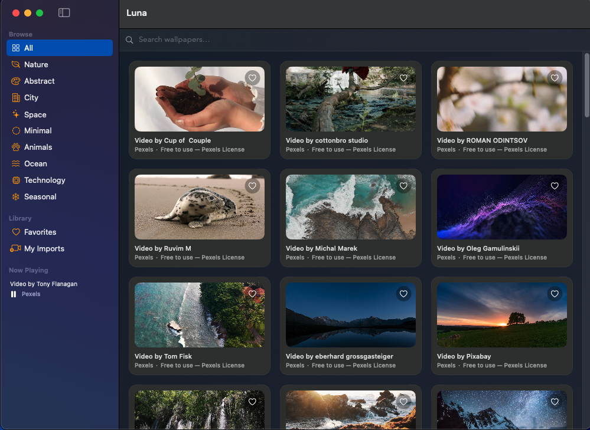
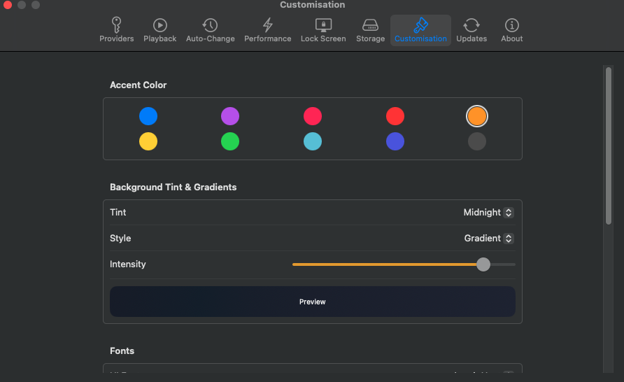
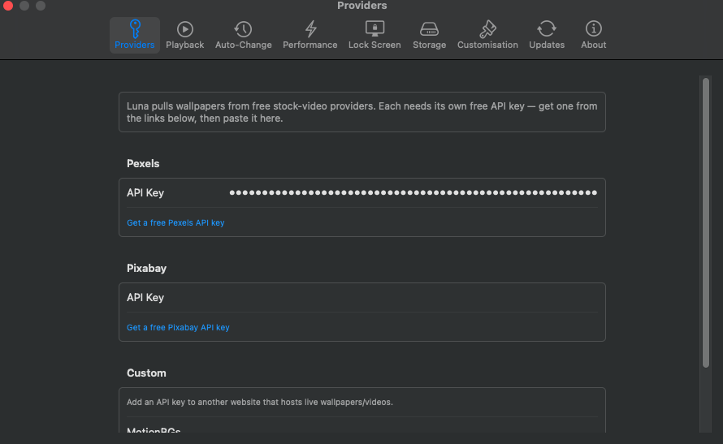
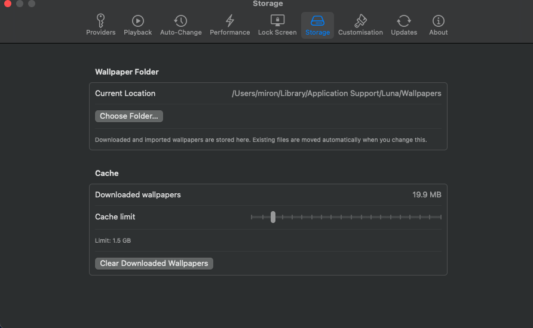
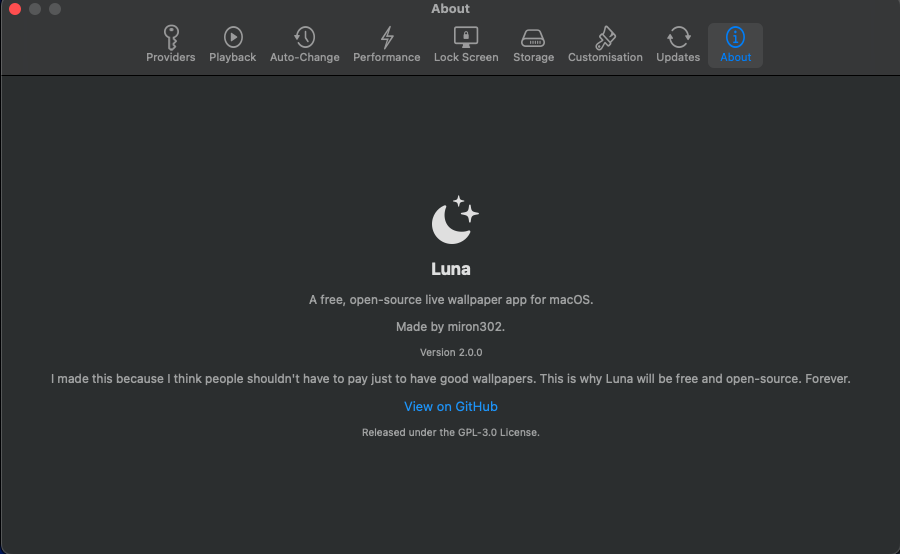

  

# Luna

**A free and open-source alternative to Backdrop for macOS.**

Luna lets you use **live wallpapers on your Mac**, bringing your desktop to life with animated backgrounds while keeping the experience simple and most importantly, free for everyone.

##  Features

-  **Live wallpapers** — Use videos and other animated content as your desktop background.
-  **macOS focused** — Designed specifically for the Mac desktop experience.
-  **Completely free** — No subscriptions or paywalls.
-  **Open source** — The source code is publicly available for anyone to inspect, modify, and contribute to.
-  **Lightweight** — Built to run quietly in the background without getting in your way.
-  **Customizable** — Choose your own wallpapers and make your desktop yours.

## Why Luna?

Apps like Backdrop make live wallpapers easy, but some features are locked behind payment, and let's be honest here nobody wants to pay just to have proper wallpapers, right?

Luna aims to provide a free and open-source alternative.

No subscription.  
No unnecessary restrictions. 

## Screenshots

<table>
  <tr>
    <td></td>
    <td></td>
  </tr>
  <tr>
    <td></td>
    <td></td>
  </tr>
  <tr>
    <td colspan="2"></td>
  </tr>
</table>

## Contributing

Contributions are welcome!

If you have an idea, find a bug, or want to improve Luna, feel free to open an issue or submit a pull request.

## Consider starring this repository!
